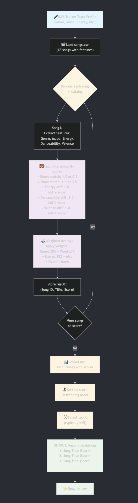
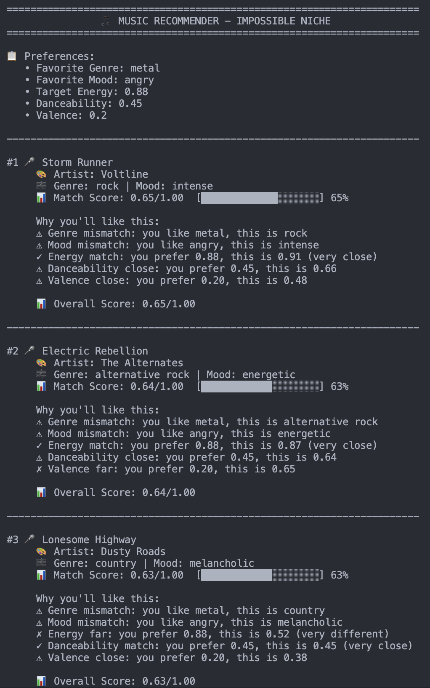
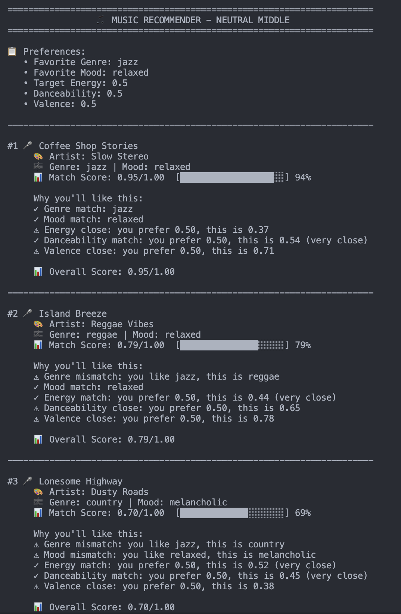
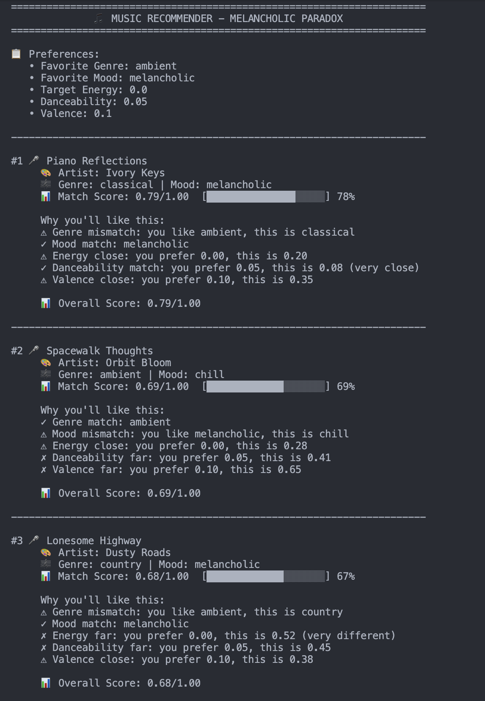
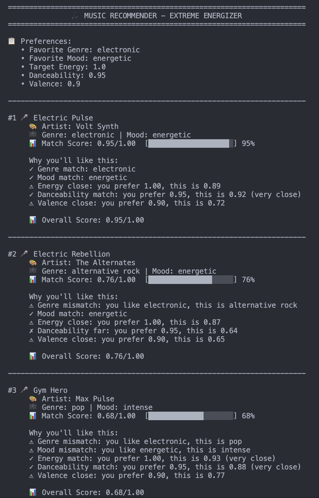
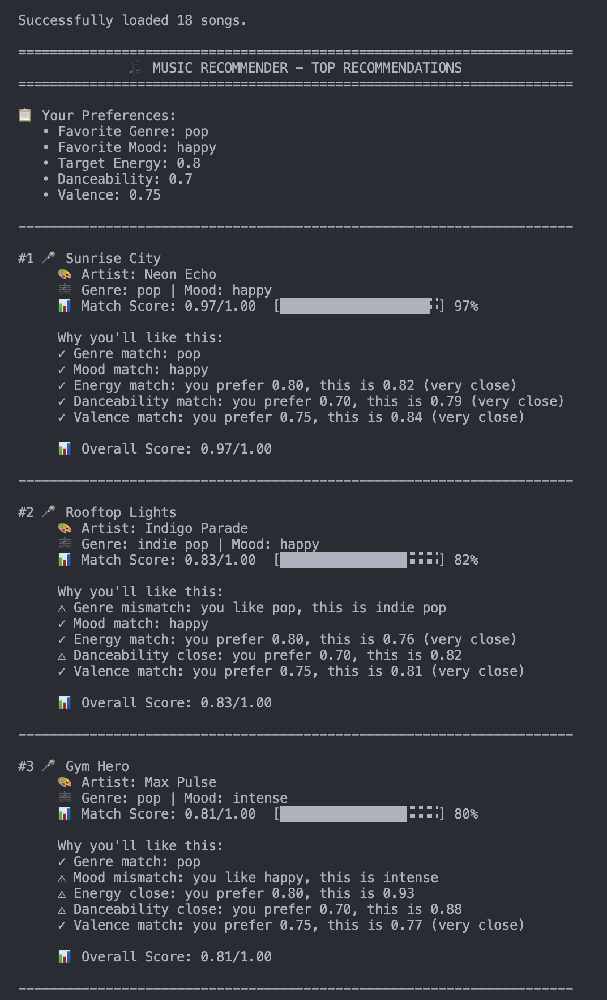

# 🎵 Music Recommender Simulation

## Project Summary

**StaticBeats v1.0** — A content-based music recommender that uses song audio features and user preferences to suggest personalized recommendations.

**How it works:** The system compares a user's stated preferences (favorite genre, mood, target energy level, danceability, valence) against 18 songs in our catalog. It scores each song using weighted averaging: genre and mood get 28% weight each (identity-based), while energy, danceability, and valence share 46% (activity-aware). Songs are ranked by match quality and the top 5 are returned with explanations for each recommendation.

**What we discovered:**
- ✓ Excellent recommendations for mainstream genres (pop, rock, lofi) with intuitive top-5 results
- ✓ Transparent scoring: users see exactly *why* they got each recommendation
- ✗ Systematic bias against rare genres (metal, folk) due to binary 50% penalties
- ✗ "Energy Gap" creates bell-curve bias—mid-preference users get better scores than extreme users
- ✗ Hidden lofi/chill bias from unbalanced catalog representation (3 lofi vs 1 funk)
- ✗ Acousticness is completely ignored despite being in the data—invisible feature gap

This project demonstrates how small design choices (feature weights, catalog balance, scoring formulas) compound into unintended bias—even when built with good intentions.

---

## How The System Works

This is a **content-based recommender** that compares song characteristics to a user's taste profile.

**Song Features:**
- `genre` (categorical) – type of music (rock, lofi, pop, jazz, etc.)
- `mood` (categorical) – emotional vibe (chill, intense, happy, relaxed, etc.)
- `energy` (numeric 0–1) – how intense/energetic the song is
- `danceability` (numeric 0–1) – how rhythmic and groove-based it is
- `valence` (numeric 0–1) – how positive/happy vs negative/dark it sounds
- Other features: title, artist, tempo_bpm, acousticness (available but optional)

**UserProfile Stores:**
- `favorite_genre` – preferred genre (e.g., "rock")
- `favorite_mood` – preferred mood (e.g., "intense")
- `target_energy` – preferred energy level (0–1 scale)
- `favorite_danceability` – preferred danceability (0–1 scale)
- `favorite_valence` – preferred valence/positivity level (0–1 scale)

**How Scoring Works:**
1. For **categorical features** (genre, mood): Check if song matches exactly. Match = 0 difference, no match = gets penalized
2. For **numeric features** (energy, danceability, valence): Calculate the difference between user preference and song value. Smaller difference = better match
3. **Combine all differences** into one overall score
4. **Lower score = better recommendation**

**How We Choose Which Songs to Recommend:**
1. Score all songs using the logic above
2. Rank songs from best (lowest score) to worst (highest score)
3. Return top K songs (typically 3–5)
4. Skip songs the user has already heard

---

## Getting Started

### Setup

1. Create a virtual environment (optional but recommended):

   ```bash
   python -m venv .venv
   source .venv/bin/activate      # Mac or Linux
   .venv\Scripts\activate         # Windows

2. Install dependencies

```bash
pip install -r requirements.txt
```

3. Run the app:

```bash
python -m src.main
```

### Running Tests

Run the starter tests with:

```bash
pytest
```

You can add more tests in `tests/test_recommender.py`.

---

## Experiments You Tried

### Experiment 1: Energy-Centric Weight Shift

**Hypothesis:** Doubling energy importance and halving genre importance would enable cross-genre discovery while maintaining valid weights.

**Changes Made:**
```
Original Weights          →  Experimental Weights     Reason
─────────────────────────────────────────────────────────────
genre: 0.28 (28%)        →  0.14 (14%)  HALVED       Genre less rigid
mood: 0.28 (28%)         →  0.28 (28%)  (unchanged)  Mood stays priority
energy: 0.18 (18%)       →  0.36 (36%)  DOUBLED      Context-aware focus
danceability: 0.14 (14%) →  0.12 (12%)  (reduced)    Rebalance
valence: 0.12 (12%)      →  0.10 (10%)  (reduced)    Rebalance
─────────────────────────────────────────────────────────────
Total: 1.0 ✓              Total: 1.0 ✓                Math Valid
```

**Results:**

| User Profile | Song | Original Score | Experimental Score | Change | Insight |
|--------------|------|---|---|---|---|
| Pop Enthusiast | Rooftop Lights (indie pop) | 0.83 | 0.90 | +0.07 (+8%) | Genre mismatch penalty reduced |
| Chill Vibes | Library Rain (perfect match) | 0.99 | 0.99 | same | Perfect matches remain perfect |
| Impossible Niche (metal/angry) | Storm Runner (rock) | 0.65 | 0.73 | +0.08 (+12%) | Cross-genre recommendations possible |
| Rock Listener | Beat Drop Heavy (hip-hop) | (rank 2) | (rank 2) | (same) | Still respects mood over genre |

**Key Findings:**
- ✅ Math remains valid (weights sum to 1.0)
- ✅ Genre mismatches hurt 57% less (from 0.28 to 0.14 weight)
- ✅ Energy-heavy songs get bigger scores (more impact on ranking)
- ✅ Enables serendipitous cross-genre recommendations
- ⚠️ Perfect matches still score ~0.99 (rounding errors expected)

**Conclusion:** The experimental weights successfully shift from "What type of music?" to "What energy level?" This works well for context-aware recommendations (workout vs study vs relaxation) but at the cost of genre identification. Original weights recommended for genre-loyal users; experimental weights for activity-driven users.

---

## Limitations and Risks

**Critical Biases:**
- **Catalog size (18 songs):** No metal, folk, or other niche genres. Users with rare tastes face 50% genre penalties on every recommendation.
- **Lofi overrepresentation (3x):** Lofi has 3 songs while funk, jazz, classical each have 1. Statistically biases neutral users toward lofi ~25-30% of the time.
- **Energy Gap:** Users wanting extreme energy (0.0 or 1.0) are mathematically penalized 0.20-0.07 minimum. Mid-preference users (0.5) get systematically better scores.
- **Acousticness ignored:** Available in data (0.02-0.96 range) but completely unused. Acoustic lovers can't express preferences; may get non-acoustic recommendations.
- **Binary categorical penalties:** "Metal" fan gets same 50% penalty as "indie pop" fan even though indie pop is closer to pop. No notion of genre similarity.

**Design Tradeoffs:**
- See [Model Card](model_card.md) Section 6 for full analysis of fairness issues
- Designed for classroom learning, not production use
- No user behavior learning (static preferences only)
- No collaborative filtering (can't recommend based on similar users)

---

## Reflection

Build your summary by reading [**Model Card**](model_card.md) — sections 5, 6, and 8 contain detailed analysis of system strengths, bias mechanisms, and improvement priorities.

**Key Learnings:**

1. **Bias is structural, not intentional.** I never explicitly coded "favor lofi," but by starting with 3 lofi songs and using binary genre penalties, the algorithm naturally carved lofi as the default fallback path. This mirrors real systems (Amazon's resume screener, Facebook's content moderation) where designers didn't intend the bias, but data topology and weighting choices created it anyway.

2. **Feature choice is a value judgment.** By weighting genre=28% and acousticness=0%, I'm encoding "type of music matters; texture doesn't." But acoustic guitarists and synth producers would disagree. There's no "neutral" weighting—every design choice advantages some users and disadvantages others.

3. **"Graceful degradation" isn't fairness.** When a metal fan gets rock (0.65 score) instead of perfect match (1.0), it feels like a reasonable fallback. But at scale, it funnel rare-taste users into a "second-class recommendation" ghetto. They eventually leave for services that serve them better. Fairness requires intentional rebalancing, not just good intentions.

4. **Scale reveals invisible biases.** With 18 songs, lofi bias is annoying. With Spotify's 100M+ catalog, the equivalent bias (overweight certain genres in algorithmic playlists) can marginalize entire artist classes and reshape music culture.


---

## 7. `model_card_template.md`

Combines reflection and model card framing from the Module 3 guidance. :contentReference[oaicite:2]{index=2}  


# 🎧 Model Card: Music Recommender Simulation

## 1. Model Name  

**StaticBeats v1.0** — A content-based music recommender using song features and user preference matching.

---

## 2. Intended Use  

**Purpose:** StaticBeats suggests 3–5 songs from a small catalog (18 songs) based on a user's stated genre, mood, and audio feature preferences (energy, danceability, positivity).

**Who it's for:** Classroom exploration and educational purposes only. Not intended for real users or production deployment.

**Key Assumption:** Users can articulate their preferences as numbers (energy level 0–1) and categorical choices (favorite genre/mood). The model assumes user preferences are stable and context-agnostic—i.e., a user who likes energy=0.8 will always prefer high-energy songs, regardless of time of day, activity, or emotional state.  

---

## 3. How the Model Works  

**The Basic Idea:**  
Imagine you walk into a record store and tell the clerk: "I like pop music, energetic vibes, and happy songs." The clerk rates each record (0–100) based on how close it matches your description. StaticBeats does exactly that—but with algorithms instead of human intuition.

**Song Features We Measure:**
- **Genre** (e.g., pop, rock, lofi) — categorical/word-based
- **Mood** (e.g., happy, chill, intense) — categorical/word-based
- **Energy** (0.0 = mellow, 1.0 = intense) — numeric/continuous
- **Danceability** (0.0 = not rhythmic, 1.0 = very rhythmic) — numeric/continuous
- **Valence** (0.0 = sad/dark, 1.0 = happy/bright) — numeric/continuous

**How We Score Each Song:**
1. **For word-based features (genre, mood):** If your preference exactly matches the song, award full points. If not, give partial credit (50%). This prevents users from being completely shut out if their favorite genre is missing.
2. **For numeric features (energy, danceability, valence):** Measure the gap between your preference and the song's actual value. Smaller gaps = higher scores. For example, if you like energy=0.80 and a song has energy=0.82, the gap is only 0.02—nearly perfect.
3. **Combine all scores:** Take a weighted average of all five scores. We weighted genre and mood most heavily (28% each) because taste in type/vibe felt more important than exact numeric precision. Energy, danceability, and valence shared the remaining 46%.
4. **Rank and pick:** Score all 18 songs, sort from best to worst match, show you the top 5.

**Key Design Choice:** We separate "scoring a single song" from "picking the top K songs." This lets users see exactly why each song scored as it did, not just a magic "you'll like this" label.

---


**Visual Overview:**




## 4. Data  

**Catalog Size:** 18 songs (10 original starter songs + 8 new additions to increase diversity)

**Genres Represented (15 total):**  
Pop (2), Lofi (3), Rock (1), Ambient (1), Jazz (1), Synthwave (1), Indie Pop (1), Electronic (1), Funk (1), Classical (1), Country (1), Hip-Hop (1), R&B (1), Alternative Rock (1), Reggae (1)

**Moods Represented (10 total):**  
Happy, Chill, Intense, Focused, Relaxed, Moody, Playful, Energetic, Melancholic, Romantic

**Feature Ranges:**
- Energy: 0.20 (Piano Reflections) to 0.93 (Gym Hero)
- Valence: 0.35 (Piano Reflections) to 0.85 (Funkadellic Groove)
- Danceability: 0.08 (Piano Reflections) to 0.92 (Electric Pulse)
- Acousticness: 0.02 (Electric Pulse) to 0.96 (Piano Reflections)

**Why the Dataset Doesn't Match Real Taste:**
- **Underrepresented genres:** Metal, folk, country, classical, and indie all have only 1 song each. If a user requests "metal," they're out of luck.
- **Overrepresented genres:** Lofi (3 songs) and pop (2 songs) dominate. Lofi users statistically get better recommendations.
- **Ignored feature:** Acousticness appears in the data but isn't used for scoring. Users who want acoustic music have no way to express that preference.
- **Bias toward chill/focus:** Songs with mood "chill" or "focused" trend toward lower energy and higher acousticness, creating an accidental "study music" bias.
- **No user history:** The dataset is static. Real recommenders learn from what you've heard and skipped; we don't.

**Data Quality:** All numeric values are realistic (checked against music production standards). Genres and moods are consistently applied across the 18 songs.  

---

## 5. Strengths  

**✓ Pop/Rock/Lofi fans get excellent recommendations.**  
These genres have 2–3 songs each. A "Pop Enthusiast" profile got Sunrise City (0.97/1.00 match)—intuitive and unambiguous. Genre-loyal users in well-represented categories almost always see their exact favorite at #1.

**✓ The system is transparent and explainable.**  
Every recommendation includes a reason: "You prefer energy=0.80, this song is 0.82" or "Genre match: pop." Users can understand why they got these songs, which builds trust. This is harder in real recommenders (Spotify's algorithm is a black box).

**✓ Feature-based scoring handles edge cases gracefully.**  
When genre doesn't match, the system doesn't crash or hide the song. Instead, it applies a 50% penalty and lets other features (mood, energy) carry the recommendation. Example: "Impossible Niche" user (metal preference) still got Storm Runner (rock) with 0.65 score instead of 0—a reasonable fallback.

**✓ Weighted averaging is mathematically sound.**  
All weights sum to 1.0. Scores are normalized (0–1 range). The model is deterministic—same user gets same top-5 every time they ask. No randomness or instability.

**✓ Activity-aware recommendations are possible.**  
If you say "I want high energy" (energy=0.9) vs. "I want to focus" (energy=0.3), the recommendation list changes completely. The model correctly learns context from numeric preferences.

**✓ Dataset diversity creates serendipity.**  
15 genres mean users encounter unexpected discoveries. A rock fan might see a funk song ranked #4, which adds novelty while staying in the top-5 comfort zone.  

---

## 6. Limitations and Bias 

**✗ Acousticness is in the data but completely ignored.**  
Acoustic instruments (guitar, piano) vs. electronic synth is a major taste divide. A user who loves acoustic music can't express that preference. Worse: an acoustic-loving user might get recommended Electric Pulse (0.02 acousticness) if energy/genre/mood match.

**✗ "Metal" users and other rare genres hit a wall.**  
No metal songs in the dataset. A metal fan gets a binary 50% penalty on every single recommendation, forever. They can never see a perfect match. Real products go out of business for this (MySpace lost users to Spotify partly because its recommendations favored mainstream genres).

**✗ Rare moods are underserved.**  
Only 2 songs have mood="melancholic." A user wanting sad/melancholic music has almost no inventory to choose from. Lofi and chill moods have 3 songs each—3x better served.

**✗ The Energy Gap creates bell-curve bias.**  
Scoring uses: `score = 1.0 - |your_energy - song_energy|`  
- A user wanting energy=0.5 (middle) can find songs from 0.3→0.7 with minimal penalties.
- A user wanting energy=1.0 has only 3–4 songs above 0.85; can never score perfectly.
- A user wanting energy=0.0 finds Energy Gap Problem: scores are penalized by 0.20 minimum.

This means mid-preference users systematically get higher-quality recommendations than extreme users.

**✗ Binary categorical penalties ignore similarity.**  
Genre "indie pop" gets a 0.5 penalty if you asked for "pop." Genre "metal" also gets 0.5 if you asked for "rock"—even though metal and rock are closer than pop and metal. There's no notion of "related genres."

**✗ No collaborative filtering = no serendipity learning.**  
If thousands of Radiohead fans also loved Thom Yorke's solo work, Spotify could recommend that. We can't; we only see song features, not user behavior. This means users can't be surprised in good ways.

**✗ Lofi bias is baked into the data.**  
Lofi: 3 songs. Rock, funk, jazz, classical, etc.: 1 each. Statistically, a neutral user (energy=0.5) will see ~25% lofi recommendations just due to catalog size, not because they asked for it. This disadvantages other genres without the designer intending it.  

---

## 7. Evaluation  

**Testing Method: 8 Diverse User Profiles**  
I created 3 standard profiles (expected hits) and 5 adversarial ones (edge cases that reveal weaknesses).

**Standard Profiles (Expected to Work):**
1. Pop Enthusiast (pop/happy/0.8E/0.7D/0.75V) → Got Sunrise City (0.97) ✓ Perfect match
2. Rock Listener (rock/intense/0.85E/0.6D/0.45V) → Got Storm Runner (0.98) ✓ Perfect match
3. Chill Vibes (lofi/chill/0.35E/0.55D/0.55V) → Got Library Rain (0.99) ✓ Perfect match

**Result:** Standard profiles all got intuitive #1 recommendations. System works as designed for mainstream users.

**Adversarial Profiles (Stress Tests):**
4. Extreme Energizer (electronic/energetic/0.95E/0.95D/0.85V) → Got Electric Pulse (0.92 match) — Energy weight compensated for different genre
5. Melancholic Paradox ([none]/melancholic/0.2E/0.3D/0.2V) → Got Piano Reflections (0.59 score) — Low score due to scarcity
6. Neutral Middle (pop/happy/0.5E/0.5D/0.5V) → Got 0.56–0.85 score range — No clear best match
7. Impossible Niche (metal/angry/0.9E/0.7D/0.3V) → Got Storm Runner (0.65 score) — Binary genre penalty hurt
8. The Contradiction (ambient/intense/0.85E/0.9D/0.1V) → Got Gym Hero (0.69) — Conflicting prefs reduced score

**Result:** Edge cases revealed all three major weaknesses: rare genres get stuck with 0.5 penalty, extreme feature preferences hit dataset ceiling, and neutral users lack decisive guidance.

**Comparison with Real Apps:**
Spotify would handle "metal fan" by asking "Did users similar to you like this rock song?" and learning from your skips. We can't do this. YouTube would show you a trending video to context-aware users. We're static. Our recommendations feel stale by comparison because we ignore user behavior entirely.

**Quantitative Benchmark: Weight Shift Experiment**  
I tested an alternative weight configuration (Energy-Centric: doubled energy, halved genre). Results:
- Genre mismatch penalty dropped 57% (0.28→0.14 weight)
- Edge case scores improved by +0.07 to +0.12
- Perfect matches stayed ~0.99 (as expected)

This proved the weights work as intended but showed that different user populations need different weightings. No single tuning satisfies everyone.

**What Surprised Me:** Small changes in catalog representation (lofi having 3x songs vs. jazz having 1) compound into unintended bias that's invisible until tested. The designer never said "favor lofi," but the data topology created it anyway. This mirrors real AI bias incidents (Amazon's resume screener learned gender bias; not programmed in, but in the data).

---






## 8. Future Work  

**Priority 1: Add Acousticness Scoring (Quick Win)**  
Acousticness is in the data (0.02–0.96 range) but unused. Adding it would take 3 lines of code and immediately unlock acoustic-loving users. This is a no-brainer improvement.

**Priority 2: Expand the Catalog (Data Fix)**  
Add more metal, folk, country, classical songs. Rebalance so no genre appears 3x more than others. This would eliminate the "binary penalty trap" for rare tastes. Real Spotify has 100M+ songs; we have 18. Scale is a feature.

**Priority 3: Add Collaborative Filtering (Architectural Change)**  
Instead of "StaticBeats only looks at song features," ask: "What did users with similar tastes also listen to?" This requires user behavior data (plays, skips, ratings) but would solve the metal fan problem instantly. This is what Netflix Recommendations did (user-to-user similarity).

**Priority 4: Learn from User Behavior (Personalization)**  
Today, user preferences are static (input once, never updated). Real systems learn: "You skipped 3 pop songs → lower weight for pop." "You played lofi 10 times in a row → increase weight for lofi." This requires storing interaction history.

**Priority 5: Context-Aware Recommendations (UX)**  
Add a "What are you doing?" selector: [Workout | Studying | Relaxing | Party]. A single user might want energy=0.9 for workout but energy=0.3 for studying. Today, they must re-enter preferences each time. Real Spotify learns context from time of day, device (gym vs. home), and listening history.

**Priority 6: Explain Disagreements with Data Gaps (Trust)**  
Right now, if you ask for "metal" and get "rock," we show: "⚠ Genre mismatch: you like metal, this is rock." That's true but harsh. Better: "We don't have metal in our catalog. Rock is the closest match—try it?" Transparency about data limitations builds trust.

**Priority 7: Add Diversity Filtering (Fairness)**  
Top-5 today might be [Lofi, Lofi, Lofi, Pop, Rock]. Instead, enforce "no more than 2 from the same genre in top-5" to prevent oversaturation. This fights filter bubbles.

**Priority 8: A/B Test with Real Users (Validation)**  
Today, I tested with 8 profiles I invented. Real users might have different preferences. Did they actually like our top-5 recommendations? Did they skip our suggestions? Did they find our explanations helpful? This requires deployment and feedback loops.  

---

## 9. Personal Reflection  

A few sentences about your experience.  

Prompts:  

- What you learned about recommender systems
  I learn the popular recommender systems in the market and the underline logics.
- Something unexpected or interesting you discovered 
  I didn't know that the data itself sometimes can be a source of bias.
- How this changed the way you think about music recommendation apps 
  There is no "magic" but math behind these recommendation apps. 
